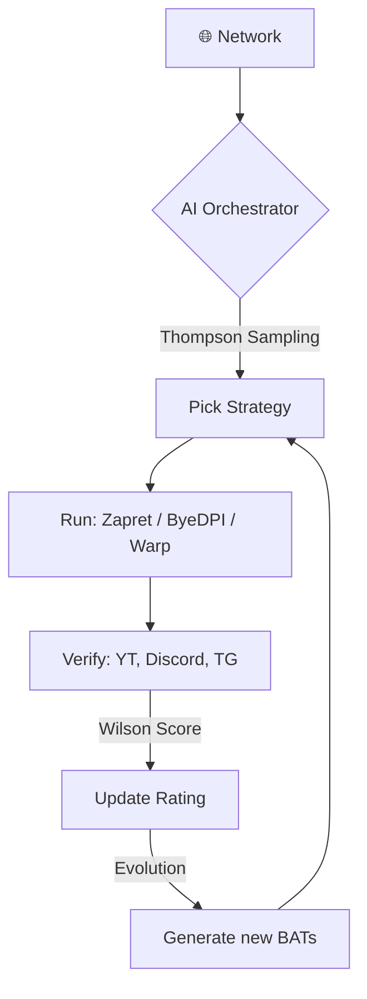

<picture>
    <source media="(prefers-color-scheme: dark)" srcset="./assets/FluxRoute-white.svg">
    <source media="(prefers-color-scheme: light)" srcset="./assets/FluxRoute-dark.svg">
    
</picture>

# FluxRoute AI `v1.6.2`

**Language:** [🇷🇺 Русский](README.md) | 🇬🇧 English

### Smart DPI Bypass Automation with AI Orchestrator and Warp Support

---

**FluxRoute AI** is a modern Windows client for managing DPI bypass tools (Zapret, ByeDPI, Warp). Its key feature is a self-learning AI that analyzes your network and automatically selects working strategies.

---

## 🚀 What's New in v1.6.2

*   **Cloudflare Warp (WireGuard):** Full `warp-plus` integration. Works standalone or chained with Zapret/ByeDPI.
*   **Auto MTU Tuning:** AI now automatically selects the optimal MTU for Warp based on connection stability.
*   **New Engine Modes:**
    *   `Hybrid`: Intelligent switching between Zapret and ByeDPI.
    *   `Warp + Zapret / ByeDPI`: Parallel launch or Chained (Zapret via Warp SOCKS5).
*   **AI Improvements:** Fast Start logic and deeper parameter mutations (Desync, FakeResend).
*   **AI Caching:** Instant restoration of top strategies when switching networks.

---

## ✨ Core Features

| Feature | Description |
|------|----------|
| 🧠 **AI Orchestrator** | Thompson Sampling for strategy selection tailored to your ISP. |
| 🧬 **Genetic Evolution** | Creating new BAT profiles by crossing the best parameters. |
| 🛡️ **Warp / AmneziaWG** | Built-in Warp support to bypass IP-based blocks. |
| 🌐 **Network Fingerprint** | Per-network AI policy (Home / Work / Mobile). |
| 📊 **Wilson Scoring** | Mathematically precise ranking based on reliability. |
| 🔄 **Auto-Updates** | All engines (zapret, byedpi, warp) update automatically from GitHub. |

---

## 🛠 How It Works

---

## 📸 Screenshots

    
    

---

## ⚠️ Important Note

The project uses **WinDivert**. Some antiviruses may flag it (RiskTool or HackTool). This is common for traffic interception tools. Please add the application folder to exclusions.

---

## 🙏 Acknowledgments

*   **[klondike0x/FluxRoute](https://github.com/klondike0x/FluxRoute)** — Original project (v1.5.0).
*   **[bol-van/zapret](https://github.com/bol-van/zapret)** — The heart of the project.
*   **[hiddify/warp-plus](https://github.com/hiddify/warp-plus)** — Warp implementation.

---

**[⭐ Star the repo](https://github.com/mx57/FluxRoute_AI) • [📥 Download](https://github.com/mx57/FluxRoute_AI/releases) • [💬 Support](https://github.com/mx57/FluxRoute_AI/issues)**

