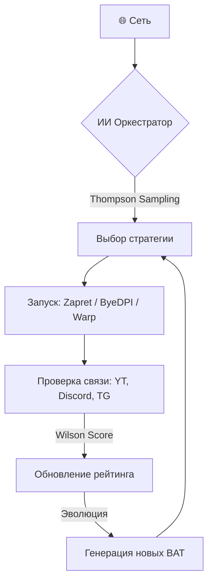

<picture>
    <source media="(prefers-color-scheme: dark)" srcset="./assets/FluxRoute-white.svg">
    <source media="(prefers-color-scheme: light)" srcset="./assets/FluxRoute-dark.svg">
    
</picture>

# FluxRoute AI `v1.6.2`

**Language:** 🇷🇺 Русский | [🇬🇧 English](README.en.md)

### Умная автоматизация обхода DPI с ИИ-оркестратором и поддержкой Warp

---

**FluxRoute AI** — это современный Windows-клиент для управления инструментами обхода DPI (Zapret, ByeDPI, Warp). Главная особенность — самообучающийся ИИ, который анализирует вашу сеть и автоматически подбирает работающие стратегии.

---

## 🚀 Новое в версии 1.6.2

*   **Cloudflare Warp (WireGuard):** Полная интеграция `warp-plus`. Работает как самостоятельно, так и в связке с Zapret/ByeDPI.
*   **Авто-тюнинг MTU:** ИИ теперь автоматически подбирает оптимальный размер MTU для Warp на основе стабильности соединения.
*   **Новые режимы работы:**
    *   `Hybrid`: Умное переключение между Zapret и ByeDPI.
    *   `Warp + Zapret / ByeDPI`: Параллельный запуск или цепочка (Zapret через Warp SOCKS5).
*   **Улучшенный ИИ:** Ускоренный старт (Fast Start) и более глубокие мутации параметров (Desync, FakeResend).
*   **Кэширование ИИ:** Мгновенное восстановление лучших стратегий при переключении сетей.

---

## ✨ Основные возможности

| Фича | Описание |
|------|----------|
| 🧠 **ИИ-оркестратор** | Thompson Sampling для подбора стратегий под конкретного провайдера. |
| 🧬 **Генетическая эволюция** | Создание новых BAT-профилей путем скрещивания лучших параметров. |
| 🛡️ **Warp / AmneziaWG** | Встроенная поддержка Warp для обхода блокировок по IP. |
| 🌐 **Network Fingerprint** | Своя политика ИИ для каждой сети (Дом / Работа / Мобильный интернет). |
| 📊 **Wilson Scoring** | Математически точное ранжирование стратегий по надежности. |
| 🔄 **Автообновление** | Все движки (zapret, byedpi, warp) обновляются автоматически из GitHub. |

---

## 🛠 Как это работает?

---

## 📸 Скриншоты

    
    

---

## ⚠️ Важное замечание

Проект использует **WinDivert**. Некоторые антивирусы могут ложно срабатывать на него (RiskTool или HackTool). Это нормально для инструментов перехвата трафика. Добавьте папку программы в исключения.

---

## 🙏 Благодарности

*   **[klondike0x/FluxRoute](https://github.com/klondike0x/FluxRoute)** — Оригинальный проект (v1.5.0).
*   **[bol-van/zapret](https://github.com/bol-van/zapret)** — Сердце проекта.
*   **[hiddify/warp-plus](https://github.com/hiddify/warp-plus)** — Реализация Warp.

---

**[⭐ Ставь звезду](https://github.com/mx57/FluxRoute_AI) • [📥 Скачать](https://github.com/mx57/FluxRoute_AI/releases) • [💬 Поддержка](https://github.com/mx57/FluxRoute_AI/issues)**

