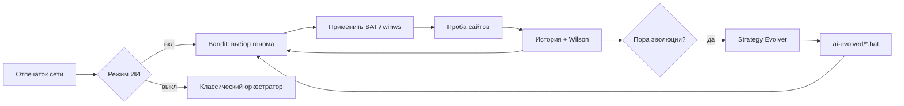
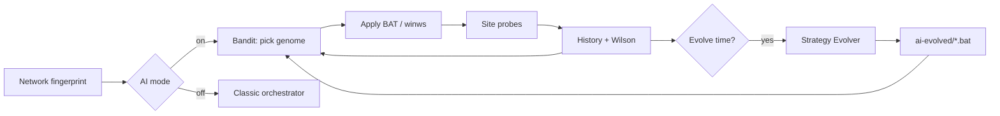

# FluxRoute Desktop

<p align="center">
  <b>Language:</b> <a href="#-fluxroute-desktop-ru">🇷🇺 Русский</a> | <a href="#-fluxroute-desktop-en">🇬🇧 English</a>
</p>

---

<a id="-fluxroute-desktop-ru"></a>

## FluxRoute Desktop [RU]

<p align="center">
    <picture>
        <source media="(prefers-color-scheme: dark)" srcset="./assets/FluxRoute-white.svg">
        <source media="(prefers-color-scheme: light)" srcset="./assets/FluxRoute-dark.svg">
        
    </picture>
</p>

<p align="center">
    <a href="https://dotnet.microsoft.com/">
        </a>
    <a href="https://github.com/klondike0x/FluxRoute/releases">
        </a>
    <a href="https://github.com/klondike0x/FluxRoute/releases">
        </a>
    <a href="./LICENSE">
        </a>
</p>

<p align="center">
  ⚡ Автоматизация zapret-профилей с умным переключением и самообучаемым ИИ<br/><br/>
  <b>FluxRoute Desktop — Windows GUI и оркестратор для Flowseal zapret-discord-youtube</b><br/>
  Управляет BAT-профилями через удобный интерфейс, автоматически подбирает рабочие конфигурации<br/>
  и эволюционирует новые стратегии обхода под вашу сеть.
</p>

> FluxRoute Desktop — GUI-оболочка для Flowseal `zapret-discord-youtube`: запуск и обновление профилей в одном окне.

---

## ⭐ Поддержать проект

Если FluxRoute оказался полезным, пожалуйста, поддержи проект:

- поставь **Star** на GitHub;
- расскажи о проекте друзьям или в тематических чатах;
- открой **Issue** с идеями и обратной связью;
- предложи улучшения через **Pull Request**.

Твоя поддержка помогает развивать FluxRoute быстрее и делать его лучше для всех 💙

---

## ❓ Почему FluxRoute

- **Удобный GUI** вместо ручного запуска BAT-файлов
- **Автообновление `engine/`** из GitHub Releases
- **Оркестратор профилей** — автоматически тестирует соединение и переключает лучший вариант при сбое
- **ИИ-оркестратор** — Thompson-sampling, эволюция BAT-стратегий и память политики для каждой сети
- **Скрытый запуск** BAT-файлов и `winws.exe` без лишних консольных окон
- **Диагностика и логи** под рукой, без прыжков между окнами

---

## ✨ Возможности

- **Компактный интерфейс** — одна кнопка Запуск/Стоп, статус и логи всегда на виду
- **Оркестратор** — автоматически тестирует все профили, выставляет рейтинг и переключается на лучший при сбоях (подробнее см. раздел **Оркестратор** ниже)
- **ИИ-оркестратор** — самообучаемый подбор и эволюция стратегий: bandit-выбор, Wilson-оценка, отпечаток сети, папка `engine/ai-evolved` (см. раздел **ИИ-оркестратор**)
- **TG WS Proxy (новое в 1.4.0)** — дополнительный прокси-канал, интегрированный в общий сценарий запуска
- **Автообновление** — при запуске проверяет новые релизы Flowseal на GitHub и обновляет `engine/` в один клик
- **Окно настроек** — выбор профиля, управление оркестратором, сайты для проверки, диагностика
- **Скрытые окна** — BAT-файлы и `winws.exe` запускаются в фоне без лишних консолей

---

## 🤖 Оркестратор

Оркестратор — это автоматическое управление профилями без ручного перебора.

В версии **1.4.0** он также работает в связке с **TG WS Proxy** как дополнительным прокси-каналом (при использовании соответствующего сценария).

При включённом **режиме ИИ** (вкладка **ИИ**) вместо классического рейтинга профилей работает **ИИ-оркестратор**: он выбирает стратегии из геномного пула, записывает результаты проб и при необходимости переключает защиту на другую стратегию.

Как он работает:

1. **Сканирует** доступные профили (кнопка «Сканировать профили»)
2. **Проверяет** доступность выбранных сайтов
3. **Оценивает** каждый профиль по рейтингу от `0` до `100%`
4. **Запускает лучший** профиль после сканирования (автоматически применяет топ результата)
5. **Переключается** на лучший профиль, если текущий перестал работать
6. **Повторно проверяет** соединение через заданный интервал  
   По умолчанию — **каждые 20 минут**

На вкладке **Оркестратор** при активном ИИ отображается блок **«Стратегии ИИ»**: галочки включают/исключают стратегии из подбора и эволюции, кнопка 🗑 удаляет эволюционированные варианты.

Это позволяет держать рабочий профиль активным почти без ручного вмешательства.

---

## 🧠 ИИ-оркестратор

Модуль **FluxRoute.AI** добавляет адаптивный движок стратегий поверх обычного оркестратора. ИИ не заменяет zapret — он **управляет тем, какой BAT-профиль запускать**, накапливает опыт по сети и **создаёт новые варианты** на основе удачных конфигураций.

### Возможности

| Компонент | Назначение |
|:---|:---|
| **Strategy Genome** | Типизированное представление стратегии (фильтры, desync, split, fake TLS и др.), извлекается из BAT |
| **Bandit Selector** | Выбор стратегии через **Thompson Sampling** с настраиваемым exploration (‰) |
| **Strategy Evolver** | Скрещивание лучших геномов по **нижней границе Wilson**; мутации параметров zapret |
| **Network Fingerprint** | Отпечаток сети (DNS, шлюз, интерфейсы) — отдельная политика на каждую сеть |
| **AiHistoryStore** | Журнал проб в `fluxroute-ai-history.jsonl` |
| **AiStrategyRegistry** | Реестр геномов, bandit-состояние, счётчик поколений |
| **BatMaterializer** | Запись эволюционированных стратегий в `engine/ai-evolved/*.bat` |

### Как это работает



1. При старте оркестратора ИИ синхронизирует встроенные профили `engine/` в реестр геномов.
2. По **отпечатку текущей сети** выбирается стратегия (exploitation через Thompson или exploration — редкие варианты).
3. После каждой проверки результат сохраняется; при серии сбоев — переключение на другую стратегию.
4. Периодически (или по кнопке **«Эволюция сейчас»**) эволютор создаёт потомка от лучших родителей и материализует новый BAT.
5. При смене сети (Wi‑Fi ↔ Ethernet, другой DNS) отпечаток меняется — ИИ подстраивает выбор под новую среду.

### Вкладка «ИИ»

| Элемент | Описание |
|:---|:---|
| **Включить самообучаемый подбор** | Оркестратор использует ИИ вместо простого рейтинга профилей |
| **Exploration (‰)** | Доля «исследования» редких стратегий (по умолчанию `100` = 10%) |
| **Сеть / Поколение / Проб** | Текущий отпечаток сети, номер поколения эволюции, записей в истории |
| **⚗ Эволюция сейчас** | Принудительный запуск эволюции и обновление списка стратегий |
| **↺ Сброс модели** | Очистка реестра, bandit-состояния и истории проб |
| **📁 ai-evolved** | Открыть папку с сгенерированными BAT-файлами |
| **Список стратегий** | Имя, происхождение (builtin / evolved), Wilson-оценка, последняя верификация |

Ручное включение стратегий и удаление эволюционированных — на вкладке **Оркестратор** (блок «Стратегии ИИ»).

### Быстрый сценарий

1. Обновите `engine/` на вкладке **Обновления**.
2. Включите **режим ИИ** на вкладке **ИИ**.
3. На вкладке **Оркестратор** задайте сайты для проверки и нажмите **Запустить оркестратор** (или сначала **Сканировать профили**).
4. Дождитесь нескольких циклов проверки — в списке стратегий появятся Wilson-оценки.
5. При необходимости нажмите **Эволюция сейчас** — новые BAT появятся в `engine/ai-evolved/`.

### Параметры (файл настроек)

| Параметр | По умолчанию | Смысл |
|:---|:---:|:---|
| `Enabled` | `false` | Режим ИИ в UI |
| `ExplorationRatePermil` | `100` | Exploration в промилле (‰) |
| `MaxEvolvedStrategies` | `24` | Лимит эволюционированных стратегий |
| `EvolutionIntervalMinutes` | `60` | Минимальный интервал авто-эволюции |
| `MinProbesBeforeEvolve` | `6` | Проб до первой авто-эволюции |
| `KeepHistoryDays` | `14` | Срок хранения истории проб |

### Файлы данных

Рядом с настройками приложения (каталог `%AppData%` / локальный конфиг):

- `fluxroute-ai-strategies.json` — реестр геномов и bandit
- `fluxroute-ai-history.jsonl` — журнал проб (сеть, геном, score, время)

Эволюционированные профили на диске: **`engine/ai-evolved/`**.

---

## 📸 Скриншоты

| Главное окно | Запущено |
|:---:|:---:|
|  |  |

| Оркестратор | Обновления |
|:---:|:---:|
|  |  |

| Сервис |
|:---:|
|  |

---

## 🚀 Быстрый старт

### Требования

- **Windows 10/11 x64**
- **Права администратора** для корректной работы `winws.exe`

### Первый запуск

1. Скачай последний релиз в разделе [Releases](https://github.com/klondike0x/FluxRoute/releases)
2. Распакуй ZIP в любую удобную папку
3. Запусти `FluxRoute.exe` **от имени администратора**
4. Открой вкладку **Обновления** и нажми **Проверить** → **Обновить**
5. После загрузки актуального `engine/` выбери профиль и нажми **▶ Запустить**
6. *(опционально)* Включи **режим ИИ** на вкладке **ИИ** и запусти **оркестратор** для адаптивного подбора стратегий

---

## 📁 Структура проекта

```
FluxRoute/
├── FluxRoute/              — UI (WPF, Views, ViewModels, вкладка «ИИ»)
├── FluxRoute.Core/         — Оркестратор, проверка связи, AiSettings
├── FluxRoute.AI/           — ИИ-движок (bandit, evolver, fingerprint, registry)
├── FluxRoute.Core.Tests/   — Unit-тесты (bandit, evolver, parser, fingerprint)
├── FluxRoute.Updater/      — Автообновление engine/ с GitHub
└── engine/                 — Скрипты Flowseal (скачиваются автоматически)
    └── ai-evolved/         — BAT-стратегии, созданные эволюцией (при работе ИИ)
```

---

## 🛠️ Сборка из исходников

**Требования:**
- .NET 10 SDK
- Visual Studio 2026

```bash
git clone https://github.com/klondike0x/FluxRoute.git
cd FluxRoute
dotnet build
```

---

## ⚠️ Дисклеймер

FluxRoute Desktop является **GUI-оболочкой** для проекта [Flowseal/zapret-discord-youtube](https://github.com/Flowseal/zapret-discord-youtube).

Все права на `zapret`, `winws.exe` и связанные с ними скрипты принадлежат их авторам.  
Этот репозиторий не претендует на авторство оригинальной низкоуровневой сетевой части.

---

## 🐞 Нашёл баг?

Если что-то работает не так, открой [Issue](https://github.com/klondike0x/FluxRoute/issues) и по возможности укажи:

- что произошло;
- что ты ожидал увидеть;
- как это воспроизвести;
- какой профиль был выбран;
- что написано в логах или диагностике.

Чем точнее описание, тем быстрее получится разобраться.

---

## 🧩 Основа engine

FluxRoute использует следующую экосистему проектов:

- [**WinDivert**](https://github.com/basil00/WinDivert) — низкоуровневая Windows-основа
- [**bol-van/zapret**](https://github.com/bol-van/zapret) — оригинальный проект
- [**bol-van/zapret-win-bundle**](https://github.com/bol-van/zapret-win-bundle) — Windows-бандл с `winws.exe`
- [**Flowseal/zapret-discord-youtube**](https://github.com/Flowseal/zapret-discord-youtube) — непосредственная основа `engine/`, используемая в FluxRoute

---

## 💡 Вдохновение

Проекты, которые вдохновили на создание FluxRoute Desktop:

- [**Zapret-GUI**](https://github.com/medvedeff-true/Zapret-GUI) — от `medvedeff-true`
- [**ZapretControl**](https://github.com/Virenbar/ZapretControl) — от `Virenbar`
- [**zapret**](https://github.com/youtubediscord/zapret) — от `youtubediscord`

---

## 📄 Лицензия

Проект распространяется по лицензии **GNU General Public License v3.0**.  
Подробности — в файле [LICENSE](./LICENSE).

---

<a id="-fluxroute-desktop-en"></a>

## FluxRoute Desktop [EN]

<p align="center">
    <picture>
        <source media="(prefers-color-scheme: dark)" srcset="./assets/FluxRoute-white.svg">
        <source media="(prefers-color-scheme: light)" srcset="./assets/FluxRoute-dark.svg">
        
    </picture>
</p>

<p align="center">
    <a href="https://dotnet.microsoft.com/">
        </a>
    <a href="https://github.com/klondike0x/FluxRoute/releases">
        </a>
    <a href="https://github.com/klondike0x/FluxRoute/releases">
        </a>
    <a href="./LICENSE">
        </a>
</p>

<p align="center">
  ⚡ Smart automation for zapret profile switching with self-learning AI<br/><br/>
  <b>FluxRoute Desktop — Windows GUI and orchestrator for Flowseal zapret-discord-youtube</b><br/>
  Manages BAT profiles through a clean interface, automatically selects working configurations,<br/>
  and evolves new bypass strategies tailored to your network.
</p>

> FluxRoute Desktop is a GUI wrapper for Flowseal `zapret-discord-youtube`, allowing users to launch and update profiles from a single window.

---

## ⭐ Support the Project

If FluxRoute is useful for you, please support the project:

- leave a **Star** on GitHub;
- share the project with friends or community chats;
- open an **Issue** with feedback and ideas;
- contribute improvements via **Pull Request**.

Your support helps FluxRoute grow faster and become better for everyone 💙

---

## ❓ Why FluxRoute

- **Convenient GUI** instead of manually launching BAT files
- **Automatic `engine/` updates** directly from GitHub Releases
- **Profile orchestrator** — automatically tests connectivity and switches to the best option on failure
- **AI orchestrator** — Thompson sampling, BAT strategy evolution, and per-network policy memory
- **Hidden launch** of BAT files and `winws.exe` without extra console windows
- **Diagnostics and logs** always available without jumping between windows

---

## ✨ Features

- **Compact interface** — a single Start/Stop button, status, and logs always in view
- **Orchestrator** — automatically tests all profiles, assigns ratings, and switches to the best one on failures (see the **Orchestrator** section below for details)
- **AI orchestrator** — self-learning strategy selection and evolution: bandit picking, Wilson scoring, network fingerprinting, `engine/ai-evolved` folder (see **AI Orchestrator**)
- **TG WS Proxy (new in 1.4.0)** — an additional proxy channel integrated into the overall launch workflow
- **Auto-update** — checks new Flowseal releases on GitHub and updates `engine/` in one click
- **Settings window** — profile selection, orchestrator control, test websites, and diagnostics
- **Hidden windows** — BAT files and `winws.exe` run in the background without unnecessary consoles

---

## 🤖 Orchestrator

The orchestrator is an automatic profile management system that removes the need for manual switching.

When **AI mode** is enabled ( **AI** tab), the **AI orchestrator** replaces the classic profile ranking: it picks strategies from a genome pool, records probe outcomes, and switches protection when needed.

How it works:

1. **Scans** available profiles (**Scan profiles** button)
2. **Checks** the availability of selected websites
3. **Scores** each profile with a rating from `0` to `100%`
4. **Starts the best** profile after a scan (top result is applied automatically)
5. **Switches** to the best profile if the current one stops working
6. **Re-checks** connectivity at a specified interval  
   By default — **every 20 minutes**

On the **Orchestrator** tab with AI active, the **AI Strategies** block lets you enable/disable strategies for selection and evolution, and delete evolved variants.

This helps keep a working profile active with minimal manual intervention.

---

## 🧠 AI Orchestrator

The **FluxRoute.AI** module adds an adaptive strategy engine on top of the regular orchestrator. AI does not replace zapret — it **decides which BAT profile to run**, learns per network, and **generates new variants** from successful configurations.

### Capabilities

| Component | Purpose |
|:---|:---|
| **Strategy Genome** | Typed strategy representation (filters, desync, split, fake TLS, etc.) parsed from BAT files |
| **Bandit Selector** | **Thompson Sampling** strategy pick with configurable exploration (‰) |
| **Strategy Evolver** | Crosses top genomes by **Wilson lower bound**; mutates zapret parameters |
| **Network Fingerprint** | Network signature (DNS, gateway, interfaces) — separate policy per network |
| **AiHistoryStore** | Probe log in `fluxroute-ai-history.jsonl` |
| **AiStrategyRegistry** | Genome registry, bandit state, generation counter |
| **BatMaterializer** | Writes evolved strategies to `engine/ai-evolved/*.bat` |

### How it works



1. On orchestrator start, AI syncs built-in `engine/` profiles into the genome registry.
2. By **current network fingerprint**, a strategy is chosen (Thompson exploitation or exploration of rare variants).
3. After each check, results are stored; consecutive failures trigger a switch.
4. Periodically (or via **Evolve now**), the evolver breeds offspring from top parents and materializes a new BAT.
5. When the network changes (Wi‑Fi ↔ Ethernet, different DNS), the fingerprint changes — AI adapts to the new environment.

### AI tab

| Control | Description |
|:---|:---|
| **Enable self-learning selection** | Orchestrator uses AI instead of simple profile ranking |
| **Exploration (‰)** | Share of “explore rare strategies” (default `100` = 10%) |
| **Network / Generation / Probes** | Current fingerprint, evolution generation, history record count |
| **⚗ Evolve now** | Force evolution and refresh the strategy list |
| **↺ Reset model** | Clear registry, bandit state, and probe history |
| **📁 ai-evolved** | Open the folder with generated BAT files |
| **Strategy list** | Name, origin (builtin / evolved), Wilson score, last verification |

Enable/disable strategies and delete evolved ones on the **Orchestrator** tab (**AI Strategies** block).

### Quick workflow

1. Update `engine/` on the **Updates** tab.
2. Enable **AI mode** on the **AI** tab.
3. On **Orchestrator**, set test sites and click **Start orchestrator** (or **Scan profiles** first).
4. Wait for several check cycles — Wilson scores appear in the strategy list.
5. Optionally click **Evolve now** — new BAT files land in `engine/ai-evolved/`.

### Settings (config file)

| Parameter | Default | Meaning |
|:---|:---:|:---|
| `Enabled` | `false` | AI mode in the UI |
| `ExplorationRatePermil` | `100` | Exploration in permille (‰) |
| `MaxEvolvedStrategies` | `24` | Cap on evolved strategies |
| `EvolutionIntervalMinutes` | `60` | Minimum auto-evolution interval |
| `MinProbesBeforeEvolve` | `6` | Probes before first auto-evolution |
| `KeepHistoryDays` | `14` | Probe history retention |

### Data files

Next to app settings (`%AppData%` / local config):

- `fluxroute-ai-strategies.json` — genome registry and bandit state
- `fluxroute-ai-history.jsonl` — probe journal (network, genome, score, time)

Evolved profiles on disk: **`engine/ai-evolved/`**.

---

## 📸 Screenshots

| Main Window | Running |
|:---:|:---:|
|  |  |

| Orchestrator | Updates |
|:---:|:---:|
|  |  |

| Service |
|:---:|
|  |

---

## 🚀 Quick Start

### Requirements

- **Windows 10/11 x64**
- **Administrator privileges** required for proper `winws.exe` operation

### First Launch

1. Download the latest release from the [Releases](https://github.com/klondike0x/FluxRoute/releases) section
2. Extract the ZIP archive to any convenient folder
3. Run `FluxRoute.exe` **as Administrator**
4. Open the **Updates** tab and click **Check** → **Update**
5. After the latest `engine/` is downloaded, choose a profile and click **▶ Start**
6. *(optional)* Enable **AI mode** on the **AI** tab and start the **orchestrator** for adaptive strategy selection

---

## 📁 Project Structure

```text
FluxRoute/
├── FluxRoute/              — UI (WPF, Views, ViewModels, AI tab)
├── FluxRoute.Core/         — Orchestrator, connectivity checks, AiSettings
├── FluxRoute.AI/           — AI engine (bandit, evolver, fingerprint, registry)
├── FluxRoute.Core.Tests/   — Unit tests (bandit, evolver, parser, fingerprint)
├── FluxRoute.Updater/      — Automatic engine updates from GitHub
└── engine/                 — Flowseal scripts (downloaded automatically)
    └── ai-evolved/         — BAT strategies created by evolution (when AI runs)
```

---

## 🛠️ Build from Source

**Requirements:**
- .NET 10 SDK
- Visual Studio 2026

```bash
git clone https://github.com/klondike0x/FluxRoute.git
cd FluxRoute
dotnet build
```

---

## ⚠️ Disclaimer

FluxRoute Desktop is a **GUI wrapper** for the [Flowseal/zapret-discord-youtube](https://github.com/Flowseal/zapret-discord-youtube) project.

All rights to `zapret`, `winws.exe`, and related scripts belong to their respective authors.  
This repository does not claim authorship of the original low-level networking components.

---

## 🐞 Found a Bug?

If something is not working as expected, open an [Issue](https://github.com/klondike0x/FluxRoute/issues) and, if possible, include:

- what happened;
- what you expected to happen;
- how to reproduce it;
- which profile was selected;
- what the logs or diagnostics say.

The more accurate the report, the easier it will be to investigate.

---

## 🧩 Engine Base

FluxRoute uses the following project ecosystem:

- [**WinDivert**](https://github.com/basil00/WinDivert) — low-level Windows foundation
- [**bol-van/zapret**](https://github.com/bol-van/zapret) — original project
- [**bol-van/zapret-win-bundle**](https://github.com/bol-van/zapret-win-bundle) — Windows bundle with `winws.exe`
- [**Flowseal/zapret-discord-youtube**](https://github.com/Flowseal/zapret-discord-youtube) — the direct `engine/` base used in FluxRoute

---

## 💡 Inspiration

Projects that inspired the creation of FluxRoute Desktop:

- [**Zapret-GUI**](https://github.com/medvedeff-true/Zapret-GUI) — by `medvedeff-true`
- [**ZapretControl**](https://github.com/Virenbar/ZapretControl) — by `Virenbar`
- [**zapret**](https://github.com/youtubediscord/zapret) — by `youtubediscord`

---

## 📄 License

This project is distributed under the **GNU General Public License v3.0**.  
See the [LICENSE](./LICENSE) file for details.
